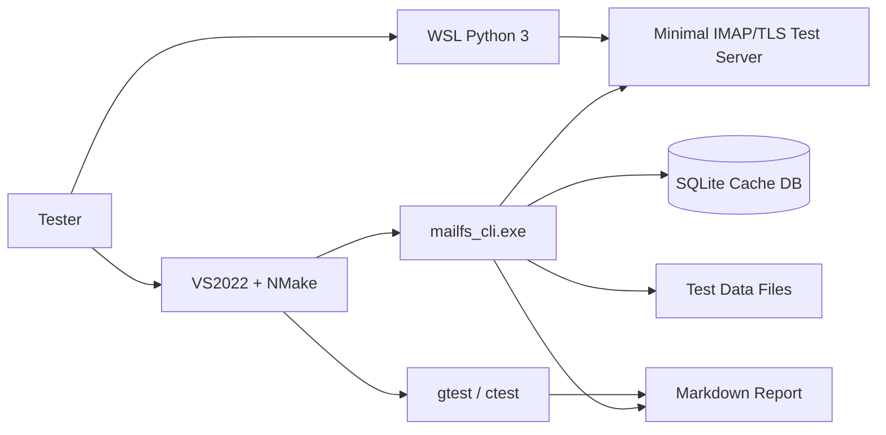

# cppMailfs Test Report

- Generated at: 2026-04-01 13:49:21
- Overall status: PASS

## Deployment Diagram



## Use Cases

1. Build the client in VS2022 with `NMake Makefiles`.
2. Run all unit tests through `ctest`.
3. Start a local TLS IMAP test server in WSL.
4. Upload a real file, cache mailbox metadata, download the file, and verify MD5.
5. Seed multiple synthetic large-file records around 1GB and validate cache/list behavior.
6. Delete one message by UID and verify server-side removal, local cache cleanup, and incomplete download rejection.

## Test Matrix

| Category | Case | Expected | Result |
|---|---|---|---|
| Build | NMake compile | `mailfs_cli.exe` and `mailfs_tests.exe` generated | PASS |
| Unit | gtest / ctest suite | All unit tests pass | PASS |
| E2E | Small file upload/cache/download | MD5 matches | PASS |
| E2E | Synthetic 1GB-class cache records | Listed and indexed correctly | PASS |
| E2E | Delete by UID | Server record removed and local cache cleared | PASS |

## Build Output

### Build Command

`cmd.exe /c tools\build_nmake.bat`

### Build Result

```text
**********************************************************************
** Visual Studio 2022 Developer Command Prompt v17.14.25
** Copyright (c) 2025 Microsoft Corporation
**********************************************************************
[vcvarsall.bat] Environment initialized for: 'x64'
-- Using the multi-header code from E:/code/cppMailfs/build-nmake/_deps/nlohmann_json-src/include/
-- Could NOT find Python3 (missing: Python3_EXECUTABLE Interpreter) 
-- Configuring done (5.2s)
-- Generating done (0.5s)
-- Build files have been written to: E:/code/cppMailfs/build-nmake
[  2%] Built target sqlite3_vendor
[  4%] Built target p256m
[  6%] Built target everest
[ 60%] Built target mbedcrypto
[ 66%] Built target mbedx509
[ 79%] Built target mbedtls
[ 87%] Built target mailfs_core
[ 89%] Built target mailfs_cli
[ 90%] Built target gtest
[ 91%] Built target gtest_main
[ 95%] Built target mailfs_tests
[ 97%] Built target gmock
[100%] Built target gmock_main
\nCMake Warning (dev) at C:/Program Files/CMake/share/cmake-3.31/Modules/FetchContent.cmake:1373 (message):
  The DOWNLOAD_EXTRACT_TIMESTAMP option was not given and policy CMP0135 is
  not set.  The policy's OLD behavior will be used.  When using a URL
  download, the timestamps of extracted files should preferably be that of
  the time of extraction, otherwise code that depends on the extracted
  contents might not be rebuilt if the URL changes.  The OLD behavior
  preserves the timestamps from the archive instead, but this is usually not
  what you want.  Update your project to the NEW behavior or specify the
  DOWNLOAD_EXTRACT_TIMESTAMP option with a value of true to avoid this
  robustness issue.
Call Stack (most recent call first):
  CMakeLists.txt:13 (FetchContent_Declare)
This warning is for project developers.  Use -Wno-dev to suppress it.

CMake Warning (dev) at C:/Program Files/CMake/share/cmake-3.31/Modules/FetchContent.cmake:1373 (message):
  The DOWNLOAD_EXTRACT_TIMESTAMP option was not given and policy CMP0135 is
  not set.  The policy's OLD behavior will be used.  When using a URL
  download, the timestamps of extracted files should preferably be that of
  the time of extraction, otherwise code that depends on the extracted
  contents might not be rebuilt if the URL changes.  The OLD behavior
  preserves the timestamps from the archive instead, but this is usually not
  what you want.  Update your project to the NEW behavior or specify the
  DOWNLOAD_EXTRACT_TIMESTAMP option with a value of true to avoid this
  robustness issue.
Call Stack (most recent call first):
  CMakeLists.txt:21 (FetchContent_Declare)
This warning is for project developers.  Use -Wno-dev to suppress it.

CMake Deprecation Warning at build-nmake/_deps/mbedtls-src/CMakeLists.txt:21 (cmake_minimum_required):
  Compatibility with CMake < 3.10 will be removed from a future version of
  CMake.

  Update the VERSION argument <min> value.  Or, use the <min>...<max> syntax
  to tell CMake that the project requires at least <min> but has been updated
  to work with policies introduced by <max> or earlier.


CMake Warning (dev) at C:/Program Files/CMake/share/cmake-3.31/Modules/FetchContent.cmake:1373 (message):
  The DOWNLOAD_EXTRACT_TIMESTAMP option was not given and policy CMP0135 is
  not set.  The policy's OLD behavior will be used.  When using a URL
  download, the timestamps of extracted files should preferably be that of
  the time of extraction, otherwise code that depends on the extracted
  contents might not be rebuilt if the URL changes.  The OLD behavior
  preserves the timestamps from the archive instead, but this is usually not
  what you want.  Update your project to the NEW behavior or specify the
  DOWNLOAD_EXTRACT_TIMESTAMP option with a value of true to avoid this
  robustness issue.
Call Stack (most recent call first):
  CMakeLists.txt:27 (FetchContent_Declare)
This warning is for project developers.  Use -Wno-dev to suppress it.

CMake Warning (dev) at C:/Program Files/CMake/share/cmake-3.31/Modules/FetchContent.cmake:1373 (message):
  The DOWNLOAD_EXTRACT_TIMESTAMP option was not given and policy CMP0135 is
  not set.  The policy's OLD behavior will be used.  When using a URL
  download, the timestamps of extracted files should preferably be that of
  the time of extraction, otherwise code that depends on the extracted
  contents might not be rebuilt if the URL changes.  The OLD behavior
  preserves the timestamps from the archive instead, but this is usually not
  what you want.  Update your project to the NEW behavior or specify the
  DOWNLOAD_EXTRACT_TIMESTAMP option with a value of true to avoid this
  robustness issue.
Call Stack (most recent call first):
  CMakeLists.txt:84 (FetchContent_Declare)
This warning is for project developers.  Use -Wno-dev to suppress it.
```

## Unit Test Output

### Unit Command

`cmd.exe /c ctest --test-dir build-nmake --output-on-failure`

### Unit Result

```text
Internal ctest changing into directory: E:/code/cppMailfs/build-nmake
Test project E:/code/cppMailfs/build-nmake
    Start 1: JsonConfigLoaderTest.LoadsOverridesAndNormalizesExtensions
1/9 Test #1: JsonConfigLoaderTest.LoadsOverridesAndNormalizesExtensions .............   Passed    0.01 sec
    Start 2: ImapResponseParserTest.ParsesLiteralAndTaggedStatus
2/9 Test #2: ImapResponseParserTest.ParsesLiteralAndTaggedStatus ....................   Passed    0.01 sec
    Start 3: ImapResponseParserTest.ParsesListSearchAndFetchLines
3/9 Test #3: ImapResponseParserTest.ParsesListSearchAndFetchLines ...................   Passed    0.01 sec
    Start 4: MailBlockMetadataTest.JsonRoundTripPreservesFields
4/9 Test #4: MailBlockMetadataTest.JsonRoundTripPreservesFields .....................   Passed    0.01 sec
    Start 5: MailBlockMetadataTest.ParsesSubjectStructure
5/9 Test #5: MailBlockMetadataTest.ParsesSubjectStructure ...........................   Passed    0.01 sec
    Start 6: MimeMessageTest.MultipartRoundTripPreservesBodies
6/9 Test #6: MimeMessageTest.MultipartRoundTripPreservesBodies ......................   Passed    0.01 sec
    Start 7: SQLiteCacheRepositoryTest.UpsertsAndQueriesBlocks
7/9 Test #7: SQLiteCacheRepositoryTest.UpsertsAndQueriesBlocks ......................   Passed    0.03 sec
    Start 8: SQLiteCacheRepositoryTest.RemoveMessageUidClearsAffectedCacheEntries
8/9 Test #8: SQLiteCacheRepositoryTest.RemoveMessageUidClearsAffectedCacheEntries ...   Passed    0.04 sec
    Start 9: SQLiteCacheRepositoryTest.PreservesLargeFileMetadataAndBlockSizes
9/9 Test #9: SQLiteCacheRepositoryTest.PreservesLargeFileMetadataAndBlockSizes ......   Passed    0.06 sec

100% tests passed, 0 tests failed out of 9

Total Test time (real) =   0.19 sec
\n
```

## End-to-End Output

### E2E Command

`wsl.exe -e bash -lc cd /mnt/e/code/cppMailfs && python3 tools/run_e2e_test.py --repo-root /mnt/e/code/cppMailfs --server-script /mnt/e/code/cppMailfs/tools/imap_test_server.py --client-exe /mnt/e/code/cppMailfs/build-nmake/mailfs_cli.exe --cert /mnt/e/code/cppMailfs/tools/test-certs/server.crt --key /mnt/e/code/cppMailfs/tools/test-certs/server.key --port 1993`

### E2E Result

```text
E2E OK
uploaded_md5=a10d7eb67499d318784c818ddee62843
downloaded_md5=a10d7eb67499d318784c818ddee62843
message_count=27
expected_blocks=5
deleted_uid=28
large_records=3
\n
```

## Conclusions

- The CLI build path under VS2022 + NMake is working.
- Unit tests cover config parsing, IMAP parsing, MIME round-trip, metadata, SQLite cache, delete-by-UID cache cleanup, and large-file metadata persistence.
- End-to-end validation covers real content transfer for a small file and synthetic 1GB-class indexing scenarios for scalability-oriented checks.
